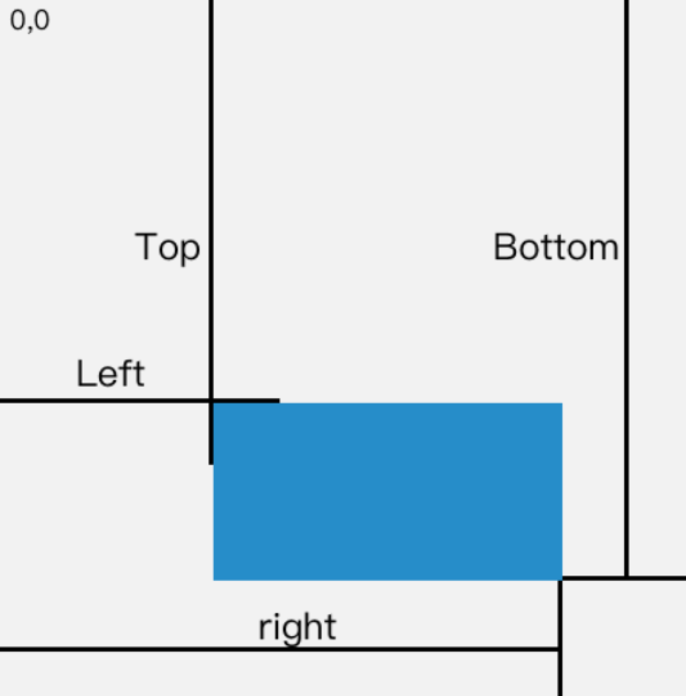

## 资料

- [getBoundingClientRect()](https://developer.mozilla.org/zh-CN/docs/Web/API/Element/getBoundingClientRect)
- [getComputedStyle(el,null)](https://developer.mozilla.org/en-US/docs/Web/API/Window/getComputedStyle)

## 学习

### getBoundingClientRect()

该方法返回某元素**相对于**浏览器视窗上下左右的位置。言简意赅为下图

### getComputedStyle

该方法是一个可以获取当前元素所有最终使用的CSS属性值，返回来一个对象。

####   **和style的区别**

- getComputedStyle方法是只读的，只能获取样式，不能设置；而`element.style`能读能写。
- getComputedStyle获取范围是更大一些，他能把浏览器默认的所有css样式都可以获取得到，而element.style只能获取元素`style`属性中的CSS样式。

